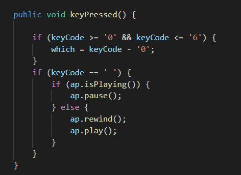
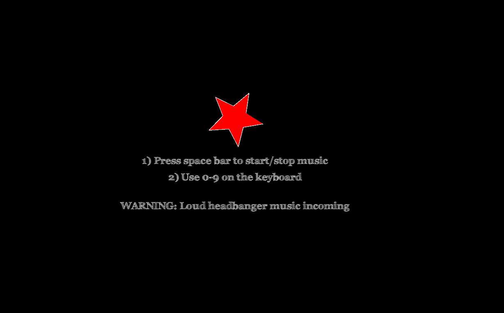

# Music Visualiser Project

Name: Cormac Smith

Student Number: C19313793

## Instructions
- Fork this repository and use it a starter project for your assignment
- Create a new package named your student number and put all your code in this package.
- You should start by creating a subclass of ie.tudublin.Visual
- There is an example visualiser called MyVisual in the example package
- Check out the WaveForm and AudioBandsVisual for examples of how to call the Processing functions from other classes that are not subclasses of PApplet

# Description of the assignment
For this assignment I created numerous visuals which respond to whatever song is being played. My goal was to create a selection of visuals which would match the tempo of the  song being played so that the listener would have something enojoyable to watch while listening to the song. I experimented with many different song types, some fast paced and some slow paced. However, I discovered that the faster paced music was a much more enjoyable experience for me to create visuals for, and I felt like the pace of the song I selected is reflected in the visuals I created. The song can easily be replaced with a song of your choice. Once it is cloned you can put your own .mp3 or .wav file into the 'data' folder and modify the 'loadAudio' on line 155 in the java file named 'MyDesign'.

The song I chose for this assignment is: https://www.youtube.com/watch?v=ySWvUHSGaBs


# Instructions
 - F5 to run the code
 - space bar to restart the song
 - 0-9 on the keyboard for different visuals
 - Some visuals react with mouse movement
 
## Controls: 


# How it works
The 'MyDesign.java' file is the main controller for this program. Upon pressing F5 the setup method will be called once. This method sets up the audio player, audio buffer, custom font and loads the song from the data folder. It also sets the frame size, creates an object for each visual as well as initalizing some important data structures which are used throughout the program(i.e lerped buffer). 

Using 0-9 on the keyboard the user can cycle through different visuals which respond to the song being currently played. Below you will find all of the visuals I created as well as a brief description about how I created it.

## WelcomeScreen:
Visual          |  Code
:-------------------------:|:-------------------------:
 |   
### What it does:
- Sets the background color to black
- Displays the control keys

# What I am most proud of in the assignment

# Markdown Tutorial

This is *emphasis*

This is a bulleted list

- Item
- Item

This is a numbered list

1. Item
1. Item

This is a [hyperlink](http://bryanduggan.org)

# Headings
## Headings
#### Headings
##### Headings

This is code:

```Java
public void render()
{
	ui.noFill();
	ui.stroke(255);
	ui.rect(x, y, width, height);
	ui.textAlign(PApplet.CENTER, PApplet.CENTER);
	ui.text(text, x + width * 0.5f, y + height * 0.5f);
}
```

So is this without specifying the language:

```
public void render()
{
	ui.noFill();
	ui.stroke(255);
	ui.rect(x, y, width, height);
	ui.textAlign(PApplet.CENTER, PApplet.CENTER);
	ui.text(text, x + width * 0.5f, y + height * 0.5f);
}
```

This is an image using a relative URL:


This is an image using an absolute URL:


This is a youtube video:

[](https://www.youtube.com/watch?v=J2kHSSFA4NU)

This is a table:

| Heading 1 | Heading 2 |
|-----------|-----------|
|Some stuff | Some more stuff in this column |
|Some stuff | Some more stuff in this column |
|Some stuff | Some more stuff in this column |
|Some stuff | Some more stuff in this column |

