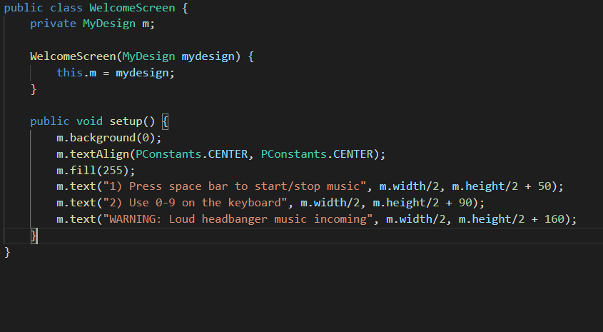
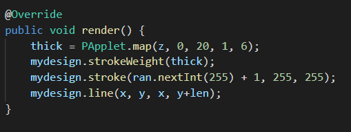

# Music Visualiser Project

Name: Cormac Smith

Student Number: C19313793

## Instructions
- Fork this repository and use it a starter project for your assignment
- Create a new package named your student number and put all your code in this package.
- You should start by creating a subclass of ie.tudublin.Visual
- There is an example visualiser called MyVisual in the example package
- Check out the WaveForm and AudioBandsVisual for examples of how to call the Processing functions from other classes that are not subclasses of PApplet

# Description of the assignment
For this assignment I created numerous visuals which respond to whatever song is being played. My goal was to create a selection of visuals which would match the tempo of the  song being played so that the listener would have something enojoyable to watch while listening to the song. I experimented with many different song types, some fast paced and some slow paced. However, I discovered that the faster paced music was a much more enjoyable experience for me to create visuals for, and I felt like the pace of the song I selected is reflected in the visuals I created. The song can easily be replaced with a song of your choice. Once it is cloned you can put your own .mp3 or .wav file into the 'data' folder and modify the 'loadAudio' on line 155 in the java file named 'MyDesign'.

The song I chose for this assignment is: https://www.youtube.com/watch?v=ySWvUHSGaBs

# Instructions
 - F5 to run the code
 - space bar to restart the song
 - 0-9 on the keyboard for different visuals
 - Some visuals react with mouse movement
 
## Controls

# How it works
The 'MyDesign.java' file is the main controller for this program. Upon pressing F5 the setup method will be called once. This method sets up the audio player, audio buffer, custom font and loads the song from the data folder. It also sets the frame size, creates an object for each visual as well as initalizing some important data structures which are used throughout the program(i.e lerped buffer). 

Using 0-9 on the keyboard the user can cycle through different visuals which respond to the song being currently played. Below you will find some of the visuals I created as well as a brief description about how I created it. Each visual implements the 'Shape' interface which can be seen below.

## Shape Interface class

 - Each shape I created implements the 'Shape' interface, therefore each class which implements it must override the update and render method.

## WelcomeScreen

  
   

### What it does
- Sets the background color to black
- Displays the control keys

## Rainfall

 - This is an array of objects which is a publicly accessible field.

 - This for loop loops through each object in the array and calls the update and render method 

### The 'Drop' class

 - This method is called from the constructor. It picks a random x co-ordinate and y co-ordinate. It also sets the speed of the drop and the length of it.

 - This method controls the speed at which the 'Drop' object moves from the top to the bottom of the screen.

 - This method maps the Z(random int) variable and sets the stroke weight. It then draws the Line object using the random x and y co-ordinates

This was a fun visual for me to make as I applied concepts learnt from the lectures such as object arrays and how to loop over them. To create this visual I followed a tutorial by The Coding Train on youtube and modified it to create a more beautiful and stimulating visual.

## Circle of Lines

This is the only visual in my program which is created in a functon. I did this because I wanted to experiment with calling a function from the same file. Every other visual is put into their own class in order to encourage two highly desirable oop concepts: high cohesion and loose coupling
### Code

 - Each iteration in the for loop calculates the x and y co-ordinate by getting the sin and cos of theta. The 'lastY' variable gets changed in each iteration resulting in a cool visual.

# What I am most proud of in the assignment

I am most proud of the 'Flow' visual. This visual matches the pace of the song so well that I found myself watching the visual till the end of the song. I created this visual by watching a video made by The Coding Train on youtube https://www.youtube.com/watch?v=IKB1hWWedMk. I thought it would be a fun visual to watch respond to the pace of the music and I was right! After watching this video and following along I learnt about 2D arrays, translations, matrices and vertices as well as using the z parameter to construct a 3D visual. I spent a long time messing around with the amount  of 'pull' on the vertices and experimenting with the y offset and x offset variables to control the flow of the visual.

The 'Flow' class has two methods:

### Render

 - The render method calculates the average amplitude and maps it to between 0 and 255. This is used as the fill colour.
 - It performs a translation so that everything is drawn relative to the center of the window. It also rotates it on the x-axis by using PI/3 (60 degrees) to give it a 3D appearence.
 - The z values for the vertices are stored in an array called 'landscape'. The values stored in this array are calculated using the noise function which returns the perlin noise value at the co-ordinates passed in.

### Update

 - The flow/speed of the visual is controlled by the move variable which is calculated using the product of the lerpedAverage and the mouseX variable.
 - Each element in the landscape arary is a value which has been mapped from the value 0-1 to a negative and postive lerpedAverage value. Furthemore, each element in the array is used for the z parameter in the render method for the vertices. It affects the amount of 'pull' on the vertices.

# Demo

